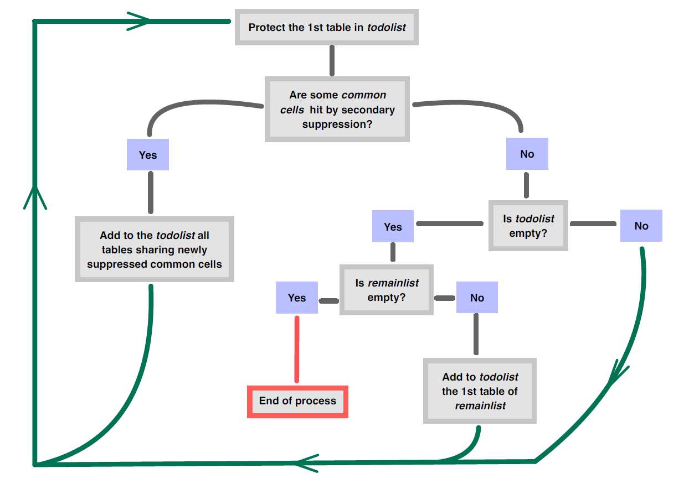

  <!--
  NE JAMAIS MODIFIER DIRECTEMENT `rtauargus.Rmd`
MODIFIER `rtauargus.Rmd.orig` ET EXECUTER `precompilation.R`
Voir : https://ropensci.org/technotes/2019/12/08/precompute-vignettes
-->


# Introduction

Dans le package `rtauargus`, il est maintenant possible de protéger un ensemble
de tableaux liés en une seule fois. La fonction pour le faire s'appelle
`tab_multi_manager()`. L'algorithme très simple implémenté pour gérer la protection
ne dépend pas du nombre de tableaux. Par conséquent,la fonction peut théoriquement
traiter un nombre indéfini de tableaux. Bien sûr, l'utilisation pratique est limitée
par la puissance de l'ordinateur. Cependant, nous sommes confiants sur la capacité
de la fonction à traiter la plupart des cas. Nous sommes intéressés par les cas que
vous pourriez rencontrer et que la fonction ne peut pas traiter.

Un lien entre deux (ou plusieurs) tableaux décrit les cellules communes des tableaux,
c'est-à-dire les cellules qui sont présentent dans ces derniers.
La fonction peut gérer tous les types de liens entre tableaux :

- les marges communes : lorsque deux tableaux partagent une (ou plusieurs)
variables de ventilation ;
- liens entre les variables de réponse, lorsqu'il existe des équations reliant
les variables ;
- hiérarchies non emboitées : lorsqu'une variable explicative est décomposée en
deux (ou plus) hiérarchies non emboitées.

En fait, les deux derniers types peuvent être traités comme le premier. Le défi pour
l'utilisateur est de définir correctement l'ensemble des tableaux. Une fois l'ensemble
correctement défini, la fonction s'occupe de tout.

Tout d'abord, la vignette présente le fonctionnement de la fonction, puis les
paramètres sont rapidement décrits. Dans la troisième partie, des exemples sont
développés pour montrer comment l'utiliser dans diverses situations.

## Comment `tab_multi_manager()` gère-t-il la protection d'un ensemble de tableaux liées ?

Tout d'abord, la fonction fusionne tous les tableaux de l'ensemble. Dans la table
obtenue, des variables booléennes sont ajoutées pour indiquer si une cellule
appartient à un tableau ou non. Il y a donc autant de variables booléennes que de
tableaux dans l'ensemble.Le tableau fusionné est un moyen très efficace pour détecter
rapidement les cellules communes. Ainsi ,le rapport des suppressions est automatisé.

Le processus de protection est séquentiel : un tableau à la fois. Pour gérer la protection
de toutes les tables et ne pas oublier une table ou des liens, l'algorithme implémenté
fonctionne avec deux listes :

  - `todolist` : liste des tables qui doivent être protégées ;
- `remainlist` : liste des tables originales qui n'ont pas encore été protégées du tout.

Les deux listes sont initialisées comme suit :

- `todolist` = première table de la liste originale ;
- `remainlist` = toutes les tables originales sauf la première.

Ensuite, l'algorithme se déroule comme indiqué dans la figure suivante :




## Résultats

La fonction renvoie la liste originale des tableaux avec d'autres variables qui
sont des variables booléennes (TRUE si la cellule doit être masquée sinon FALSE).
, décrivant toutes les étapes du processus de suppression. Chaque étape prend en
compte les résultats précédents et la dernière variable indique le statut final
d'une cellule.
Le statut final de chaque cellule est facilement déductible à l'aide de cette
dernière variable et de l'état de suppression primaire calculé précédemment par
l'utilisateur.

De plus, la fonction écrit tous les fichiers τ-Argus créés au cours du processus.
A la fin, seul le dernier processus pour chaque table est disponible dans le
répertoire choisi. Un journal (`journal.txt`) est également fourni. Il décrit chaque
étape du processus de suppression : Quelle table est protégée, combien de nouvelles
cellules communes ont été atteintes par la suppression secondaire.
À la fin du processus, il décrit toutes les cellules communes qui ont été touchées,
en mentionnant l'itération à laquelle chacune a été masquée.


## Quelques détails sur les paramètres de `tab_multi_manager()``

- **dir_name**
le répertoire qui contiendra tous les fichiers créés, s'il n'existe pas, il sera créé.
exemple : dir_name = "my_directory".

- **hrc**
Un vecteur nommé spécifiant le chemin vers le fichier hrc pour chaque variable hiérarchique.
exemple : c(ACTIVITY = "chemin_vers_fichier/act.hrc", NUTS = "chemin_vers_fichier/nuts.hrc" )

- **alt_hrc**
Une liste nommée utile pour traiter les hiérarchies non emboitées. Les noms de la liste
sont les noms des tableaux pour lesquelles une autre hiérarchie(non emboitée en général)
doit être utilisée.
exemple : Si T1 et T2 ont une variable explicative, appelée ACTIVITY, et la
même variable de réponse, mais la variable `ACTIVITY` n'a pas la même hiérarchie
dans les les deux tables. Supposons que les hiérarchies (act1.hrc et act2.hrc) ne
sont pas emboitées. Dans ce cas, nous écrivons les deux arguments comme suit :

  - hrc = c(ACTIVITY = "path_to_file/act_1.hrc") : Par défaut, cette hiérarchie sera
  utilisée pour la variable ACTIVITY.
  - alt_hrc = list(T2 = c(ACTIVITY = "chemin_vers_fichier/act_2.hrc")) : Dans la table T2,
  la hiérarchie alternative sera utilisée.

- **totcode**
Le code du total pour chaque variable explicative. Il est recommandé d'utiliser le même
même code de total pour chaque variable. Si par exemple le code est "Total" pour
toutes les variables.
La syntaxe qsuivante est autorisée : totcode = "Total"

Sinon, l'input attendue est une liste spécifiant le code total pour chaque variable
explicative.
Par exemple : totcode = list(ACTIVITY = "Total", NUTS = "FR", SIZE = "Ensemble", CJ = "Total")

Attention : Si les totaux ne sont pas dans la table, ils seront calculés par Tau-Argus,
mais ils ne seront pas éligibles pour la suppression primaire. Il est donc nécessaire
de les fournir dans la table de départ.

- **alt_totcode**
Une liste nommée pour les codes de totaux alternatifs. Voir `alt_hrc` pour l'utilisation.

- **value**
Le nom de colonne de la variable de réponse dans les tableauxs, il DOIT identique
pour chaque table.
Par exemple : valeur = "turnover".
Valeur par défaut : "value".

- **freq**
Le nom de colonne de la variable de fréquence dans les tableaux, il DOIT être le
même nom pour chaque tableau.
Par exemple : freq = "frequency"
Valeur par défaut : "freq".

- **secret_var**
Le nom de la variable booléenne spécifiant le secret primaire dans les tables,
il DOIT être le même nom pour chaque table.
Par exemple : secret_var = "is_secret_prim".
Valeur par défaut : "is_secret_prim".

- **suppression**
L'algorithme requis pour effectuer la suppression secondaire,
expliqué dans la vignette safety_rules. Si Modular est choisi, après la
après la première itération sur une table donnée, les options singleton,
multi-singleton et minFreq sont désactivées.
défaut : MOD(1,5,1,0,0)"

- **ip_start**
  Les intervalles de protection pour la première itération sur une table donnée
(nombre entier)
par défaut : 10

- **ip_end**
  Les intervalles de protection pour la deuxième itération sur une table
(nombre entier)
par défaut : 0

- **num_iter_max**
Nombre d'itération maximum sur un tableau,  ce paramètre est ici pour assurer le
fait que la fonction va s'arrêter. En pratique on n'atteint jamais la limite de 10.
par défaut : 10

# Quelques exemples

Spécifions l'emplacement du fichier TauArgus.exe sur notre ordinateur :

``{r version}
options(
  rtauargus.tauargus_exe =
    "Y:/Logiciels/TauArgus/TauArgus4.2.2b1/TauArgus.exe"
)
```

## Comment protéger 4 tableaux liés en même temps

Dans l'exemple suivant, nous allons protéger un ensemble de 4 tableaux liés partageant
la même variable de réponse, à savoir le chiffre d'affaires.

### Préparation des données


```r
data("turnover_act_size")
data("turnover_act_cj")
data ("turnover_nuts_size")
data("turnover_nuts_cj")
```

ACTIVITY X SIZE nommé turnover_act_size
ACTIVITY X CJ nommé turnover_act_cj
NUTS X SIZE nommé turnover_nuts_size
NUTS X CJ nommé turnover_nuts_cj


```r
str(turnover_act_size)
#> tibble [414 x 5] (S3: tbl_df/tbl/data.frame)
#>  $ ACTIVITY: chr [1:414] "AZ" "BE" "FZ" "GI" ...
#>  $ SIZE    : chr [1:414] "Total" "Total" "Total" "Total" ...
#>  $ N_OBS   : int [1:414] 405 12878 28043 62053 8135 8140 11961 41359 26686 25108 ...
#>  $ TOT     : num [1:414] 44475 24827613 8907311 26962063 8584917 ...
#>  $ MAX     : num [1:414] 6212 1442029 1065833 3084242 3957364 ...
str(turnover_nuts_cj)
#> tibble [452 x 5] (S3: tbl_df/tbl/data.frame)
#>  $ NUTS : chr [1:452] "FR10" "FR21" "FR22" "FR23" ...
#>  $ CJ   : chr [1:452] "Total" "Total" "Total" "Total" ...
#>  $ N_OBS: int [1:452] 38462 6769 4561 5090 8611 7811 5643 10411 8179 5163 ...
#>  $ TOT  : num [1:452] 33026385 2947560 1917663 3701935 5089279 ...
#>  $ MAX  : num [1:452] 3084242 544763 651848 298134 1165019 ...
```

La première étape consiste à créer une liste contenant nos quatre tableaux, il est
conseillé de de donner un nom à chaque table. En faisant cela, il sera plus facile
de suivre le déroulement de la pose du secret secondaire.


```r
list_data_4_tabs <- list(
  act_size = turnover_act_size,
  act_cj = turnover_act_cj,
  nuts_size = turnover_nuts_size,
  nuts_cj = turnover_nuts_cj
)
str(list_data_4_tabs)
#> List of 4
#>  $ act_size : tibble [414 x 5] (S3: tbl_df/tbl/data.frame)
#>   ..$ ACTIVITY: chr [1:414] "AZ" "BE" "FZ" "GI" ...
#>   ..$ SIZE    : chr [1:414] "Total" "Total" "Total" "Total" ...
#>   ..$ N_OBS   : int [1:414] 405 12878 28043 62053 8135 8140 11961 41359 26686 25108 ...
#>   ..$ TOT     : num [1:414] 44475 24827613 8907311 26962063 8584917 ...
#>   ..$ MAX     : num [1:414] 6212 1442029 1065833 3084242 3957364 ...
#>  $ act_cj   : tibble [406 x 5] (S3: tbl_df/tbl/data.frame)
#>   ..$ ACTIVITY: chr [1:406] "AZ" "BE" "FZ" "GI" ...
#>   ..$ CJ      : chr [1:406] "Total" "Total" "Total" "Total" ...
#>   ..$ N_OBS   : int [1:406] 405 12878 28043 62053 8135 8140 11961 41359 26686 25108 ...
#>   ..$ TOT     : num [1:406] 44475 24827613 8907311 26962063 8584917 ...
#>   ..$ MAX     : num [1:406] 6212 1442029 1065833 3084242 3957364 ...
#>  $ nuts_size: tibble [460 x 5] (S3: tbl_df/tbl/data.frame)
#>   ..$ NUTS : chr [1:460] "FR10" "FR21" "FR22" "FR23" ...
#>   ..$ SIZE : chr [1:460] "Total" "Total" "Total" "Total" ...
#>   ..$ N_OBS: int [1:460] 38462 6769 4561 5090 8611 7811 5643 10411 8179 5163 ...
#>   ..$ TOT  : num [1:460] 33026385 2947560 1917663 3701935 5089279 ...
#>   ..$ MAX  : num [1:460] 3084242 544763 651848 298134 1165019 ...
#>  $ nuts_cj  : tibble [452 x 5] (S3: tbl_df/tbl/data.frame)
#>   ..$ NUTS : chr [1:452] "FR10" "FR21" "FR22" "FR23" ...
#>   ..$ CJ   : chr [1:452] "Total" "Total" "Total" "Total" ...
#>   ..$ N_OBS: int [1:452] 38462 6769 4561 5090 8611 7811 5643 10411 8179 5163 ...
#>   ..$ TOT  : num [1:452] 33026385 2947560 1917663 3701935 5089279 ...
#>   ..$ MAX  : num [1:452] 3084242 544763 651848 298134 1165019 ...
```

### Appliquer les règles de secret primaire

Ensuite, nous devons appliquer les règles de secret primaire pour chaque table.
Ici, nous appliquons 2 règles :
La règle de dominance à 85% NK(1,85) et la règle de fréquence avec un seuil fixé à 3.


```r
list_data_4_tabs <- list_data_4_tabs %>%
  purrr::map(
    function(df){
      df %>%
        mutate(
          is_secret_freq = N_OBS > 0 & N_OBS < 3,
          is_secret_dom = ifelse(MAX == 0, FALSE, MAX/TOT>0.85),
          is_secret_prim = is_secret_freq | is_secret_dom
        )
    }
  )
str(list_data_4_tabs)
#> List of 4
#>  $ act_size : tibble [414 x 8] (S3: tbl_df/tbl/data.frame)
#>   ..$ ACTIVITY      : chr [1:414] "AZ" "BE" "FZ" "GI" ...
#>   ..$ SIZE          : chr [1:414] "Total" "Total" "Total" "Total" ...
#>   ..$ N_OBS         : int [1:414] 405 12878 28043 62053 8135 8140 11961 41359 26686 25108 ...
#>   ..$ TOT           : num [1:414] 44475 24827613 8907311 26962063 8584917 ...
#>   ..$ MAX           : num [1:414] 6212 1442029 1065833 3084242 3957364 ...
#>   ..$ is_secret_freq: logi [1:414] FALSE FALSE FALSE FALSE FALSE FALSE ...
#>   ..$ is_secret_dom : logi [1:414] FALSE FALSE FALSE FALSE FALSE FALSE ...
#>   ..$ is_secret_prim: logi [1:414] FALSE FALSE FALSE FALSE FALSE FALSE ...
#>  $ act_cj   : tibble [406 x 8] (S3: tbl_df/tbl/data.frame)
#>   ..$ ACTIVITY      : chr [1:406] "AZ" "BE" "FZ" "GI" ...
#>   ..$ CJ            : chr [1:406] "Total" "Total" "Total" "Total" ...
#>   ..$ N_OBS         : int [1:406] 405 12878 28043 62053 8135 8140 11961 41359 26686 25108 ...
#>   ..$ TOT           : num [1:406] 44475 24827613 8907311 26962063 8584917 ...
#>   ..$ MAX           : num [1:406] 6212 1442029 1065833 3084242 3957364 ...
#>   ..$ is_secret_freq: logi [1:406] FALSE FALSE FALSE FALSE FALSE FALSE ...
#>   ..$ is_secret_dom : logi [1:406] FALSE FALSE FALSE FALSE FALSE FALSE ...
#>   ..$ is_secret_prim: logi [1:406] FALSE FALSE FALSE FALSE FALSE FALSE ...
#>  $ nuts_size: tibble [460 x 8] (S3: tbl_df/tbl/data.frame)
#>   ..$ NUTS          : chr [1:460] "FR10" "FR21" "FR22" "FR23" ...
#>   ..$ SIZE          : chr [1:460] "Total" "Total" "Total" "Total" ...
#>   ..$ N_OBS         : int [1:460] 38462 6769 4561 5090 8611 7811 5643 10411 8179 5163 ...
#>   ..$ TOT           : num [1:460] 33026385 2947560 1917663 3701935 5089279 ...
#>   ..$ MAX           : num [1:460] 3084242 544763 651848 298134 1165019 ...
#>   ..$ is_secret_freq: logi [1:460] FALSE FALSE FALSE FALSE FALSE FALSE ...
#>   ..$ is_secret_dom : logi [1:460] FALSE FALSE FALSE FALSE FALSE FALSE ...
#>   ..$ is_secret_prim: logi [1:460] FALSE FALSE FALSE FALSE FALSE FALSE ...
#>  $ nuts_cj  : tibble [452 x 8] (S3: tbl_df/tbl/data.frame)
#>   ..$ NUTS          : chr [1:452] "FR10" "FR21" "FR22" "FR23" ...
#>   ..$ CJ            : chr [1:452] "Total" "Total" "Total" "Total" ...
#>   ..$ N_OBS         : int [1:452] 38462 6769 4561 5090 8611 7811 5643 10411 8179 5163 ...
#>   ..$ TOT           : num [1:452] 33026385 2947560 1917663 3701935 5089279 ...
#>   ..$ MAX           : num [1:452] 3084242 544763 651848 298134 1165019 ...
#>   ..$ is_secret_freq: logi [1:452] FALSE FALSE FALSE FALSE FALSE FALSE ...
#>   ..$ is_secret_dom : logi [1:452] FALSE FALSE FALSE FALSE FALSE FALSE ...
#>   ..$ is_secret_prim: logi [1:452] FALSE FALSE FALSE FALSE FALSE FALSE ...
```

Trois variables ont été ajoutées à chaque tableau. Seule la dernière sera utilisée
pendant le processus de suppression. Les deux autres seront utiles pour indiquer
l'état final des cellules.

### Préparation de la liste des variables explicatives

Nous allons ensuite créer la liste des variables explicatives des tableaux.
Dans notre cas, les variables explicatives sont les 2 premières colonnes de chaque tableau.


```r
nom_var_list <- purrr::map(
  list_data_4_tabs,
  function(data) colnames(data)[1:2]
)
nom_var_list
#> $act_size
#> [1] "ACTIVITY" "SIZE"    
#> 
#> $act_cj
#> [1] "ACTIVITY" "CJ"      
#> 
#> $nuts_size
#> [1] "NUTS" "SIZE"
#> 
#> $nuts_cj
#> [1] "NUTS" "CJ"
```

Les noms de la liste doivent être identiques aux noms des tableaux présent dans le paramètre
`list_tables`.

### Préparation de la liste des codes pour les totaux

Les modalités utilisées pour mentionner le total de chaque variable doivent être
déclarées par l'utilisateur, dans une liste nominative. Toutefois, lorsque toutes
les variables ont la même modalité pour pour le total, l'information peut être
spécifiée de la manière suivante :


```r
total_codes <- "Total"
```

### Préparation des fichiers hiérarchiques

`ACTIVITY` et `NUTS` sont duex variables hiérarchiques.On utilise une table de
correspondance pour chacunes d'entre  elles pour créer le fichier .hrc dont &tau;-Argus
a besoin.


```r
data(activity_corr_table)
data(nuts23_fr_corr_table)
```


```r
hrc_file_activity <- write_hrc2(
  corr_table = activity_corr_table,
  file_name = "hrc/activity.hrc"
)
hrc_file_nuts <- write_hrc2(
  corr_table = nuts23_fr_corr_table,
  file_name = "hrc/nuts.hrc"
)
```

Pour spécifier les nom des fichiers hrc, on crée un vecteur nommé (ou une liste) :


```r
hrc_files <- list(
  ACTIVITY = hrc_file_activity,
  NUTS = hrc_file_nuts
)
```

Les noms du vecteur doivent être identiques aux noms des variables hiérarchiques
présentes dans la table

### Protéger tous les tableaux en un seul appel


```r
res <- tab_multi_manager(
    list_tables = list_data_4_tabs,
    list_explanatory_vars = nom_var_list,
    dir_name = "tauargus_files/ex4",
    hrc = hrc_files,
    totcode = total_codes,
    value = "TOT",
    freq = "N_OBS",
    secret_var = "is_secret_prim"
)
#> --- Current table to treat:  act_size ---
#> --- Current table to treat:  act_cj ---
#> --- Current table to treat:  act_size ---
#> --- Current table to treat:  nuts_size ---
#> --- Current table to treat:  nuts_cj ---
```


### Résultats


```r
list_with_status <- res %>%
  purrr::map(
    function(df){
      df %>%
        rename_with(~"final_suppress", last_col()) %>%
        mutate(
          status = case_when(
            is_secret_freq ~ "A",
            is_secret_dom ~ "B",
            final_suppress ~ "D",
            TRUE ~"V"
          )
        ) %>%
        select(1:2, TOT, N_OBS, status)
    }
  )
str(list_with_status$act_size)
#> 'data.frame':	414 obs. of  5 variables:
#>  $ ACTIVITY: chr  "01" "01" "02" "02" ...
#>  $ SIZE    : chr  "Total" "tr1" "Total" "tr1" ...
#>  $ TOT     : num  853 853 43623 35503 8120 ...
#>  $ N_OBS   : int  18 18 387 381 6 1 1 4 4 84 ...
#>  $ status  : chr  "V" "V" "V" "V" ...
```


```r
list_with_status %>%
  purrr::iwalk(
    function(df,name){
      cat(name, "\n")
      df %>% count(status) %>% print()
    }
  )
#> act_size 
#>   status   n
#> 1      A  52
#> 2      B  25
#> 3      D  83
#> 4      V 254
#> act_cj 
#>   status   n
#> 1      A  35
#> 2      B  25
#> 3      D  88
#> 4      V 258
#> nuts_size 
#>   status   n
#> 1      A  55
#> 2      B  17
#> 3      D  82
#> 4      V 306
#> nuts_cj 
#>   status   n
#> 1      A  45
#> 2      B  20
#> 3      D 101
#> 4      V 286
```

## Traiter les hiérarchies non emboitées

Supposons que l'on veuille protéger les deux tableaux croisant `ACTIVITY` et
`SIZE` d'une part et `ACTIVITY` et `CJ` d'autre part. La variable `ACTIVITY` est une variable hiérarchique. De plus, dans ce cas, nous aimerions publier un sous-total, appelé `D_TO_M`, en plus de ceux de la `activity_corr_table`. Ce sous-total est la somme des étiquettes `D` à `M` du niveau `A21`. Comme ce sous-total ne peut pas être inséré dans la hiérarchie principale, cela nous conduit à un cas de hiérarchies non emboitées.

Pour confirmer le non-emboîtement des deux hiérarchies, affichons un extrait des deux.

Extrait de la hiérarchie principale :


```r
sdcHierarchies::hier_create(
  root="Total",
  nodes = activity_corr_table$A10 %>% unique()
) %>%
  sdcHierarchies::hier_display()
#> Total
#> +-AZ
#> +-BE
#> +-FZ
#> +-GI
#> +-JZ
#> +-KZ
#> +-LZ
#> +-MN
#> +-OQ
#> \-RU
```

Extrait de la hiérarchie alternative:


```r
sdcHierarchies::hier_create(
  root="D_TO_M",
  nodes = activity_corr_table_D_TO_M$A21
) %>%
  sdcHierarchies::hier_display()
#> D_TO_M
#> +-D
#> +-E
#> +-F
#> +-G
#> +-H
#> +-I
#> +-J
#> +-K
#> +-L
#> \-M
```

Pour traiter ce cas, l'approche préférée est de créer un troisième tableau croisant
`ACTIVITY` et `SIZE` avec les modalités D à M et le sous-total `D_TO_M` :


```r
turnover_act_size_D_TO_M <- turnover_act_size %>%
  filter(
    ACTIVITY %in% LETTERS[4:13]
  ) %>%
  bind_rows(
    turnover_act_size %>%
      filter(
        ACTIVITY %in% LETTERS[4:13]
      ) %>%
      group_by(SIZE) %>%
      summarise(N_OBS = sum(N_OBS), TOT = sum(TOT), MAX = max(MAX)) %>%
      mutate(ACTIVITY = "D_TO_M")
  )
str(turnover_act_size_D_TO_M)
#> tibble [44 x 5] (S3: tbl_df/tbl/data.frame)
#>  $ ACTIVITY: chr [1:44] "D" "E" "F" "G" ...
#>  $ SIZE    : chr [1:44] "Total" "Total" "Total" "Total" ...
#>  $ N_OBS   : int [1:44] 1411 828 28043 41624 6524 13905 8135 8140 11961 28221 ...
#>  $ TOT     : num [1:44] 2438454 2264393 8907311 18244309 6273334 ...
#>  $ MAX     : num [1:44] 981369 306905 1065833 765244 3084242 ...
```

Créons le fichier correspondant à cette hiérarchie :


```r
activity_corr_table_D_TO_M <- activity_corr_table %>%
  filter(A21 %in% LETTERS[4:13]) %>%
  select(-A88) %>%
  mutate(A10 = "D_TO_M") %>%
  unique()

hrc_file_activity_D_TO_M <- activity_corr_table_D_TO_M %>%
  select(-1) %>%
  write_hrc2(file_name = "hrc/activity_D_TO_M")
```

Ensuite, construisons la liste des tableaux et appliquons les règles de secret
primaire dessus.


```r
list_data_3_tabs_nn <- list(
  act_size = turnover_act_size,
  act_size_D_TO_M = turnover_act_size_D_TO_M,
  act_cj = turnover_act_cj
) %>%
  purrr::map(
    function(df){
      df %>%
        mutate(
          is_secret_freq = N_OBS > 0 & N_OBS < 3,
          is_secret_dom = ifelse(MAX == 0, FALSE, MAX/TOT>0.85),
          is_secret_prim = is_secret_freq | is_secret_dom
        )
    }
  )
```

Les arguments `hrc` et `alt_hrc` sont utilisés pour mentionner les deux hiérarchies
de la variable `ACTIVITY` :

  - `hrc` est utilisé comme dans l'exemple précédent (un vecteur nommé où les noms
sont les différentes variables hiérarchiques apparaissant dans les tableaux et les
valeurs sont les noms des fichiers). Ainsi, le fichier de hiérarchie par défaut
sera pris dans ce vecteur.
- `alt_hrc` n'est utilisé que pour mentionner les hiérarchies alternatives.
Cet argument est une liste nommée où les noms sont les tableaux où les hiérarchies
alternatives doivent être appliquées.

Le même raisonnement est utilisé pour remplir l'argument `alt_totcode`.


```r
res <- tab_multi_manager(
  list_tables = list_data_3_tabs_nn,
  list_explanatory_vars = list(
    act_size = c("ACTIVITY", "SIZE"),
    act_size_D_TO_M = c("ACTIVITY", "SIZE"),
    act_cj = c("ACTIVITY", "CJ")
  ),
  hrc = c(ACTIVITY = hrc_file_activity),
  alt_hrc = list(
    act_size_D_TO_M = c(ACTIVITY = hrc_file_activity_D_TO_M)
  ),
  dir_name = "tauargus_files/ex5",
  value = "TOT",
  freq = "N_OBS",
  secret_var = "is_secret_prim",
  totcode =  "Total",
  alt_totcode = list(
    act_size_D_TO_M = c(ACTIVITY = "D_TO_M")
  )
)
#> --- Current table to treat:  act_size ---
#> --- Current table to treat:  act_size_D_TO_M ---
#> --- Current table to treat:  act_cj ---
#> --- Current table to treat:  act_size ---
#> --- Current table to treat:  act_size_D_TO_M ---
#> --- Current table to treat:  act_size ---
#> --- Current table to treat:  act_cj ---
```

#### Détail de la vignette

- Authors: **<a href="mailto:julien.jamme@insee.fr">Julien Jamme</a>** & **<a href="mailto:nathanael.rastout@insee.fr">Nathanael Rastout</a>**
  - Last update: **06/01/2023**
  - Version of rtauargus used: **1.1.1**
  - Version of &tau;-Argus used : **TauArgus 4.2.2b1**
  - R version used :  **4.1.3**

  <p style="text-align: right">
  <a href="#TOC" title="Back to summary">summary &uarr;</a>
  </p>
