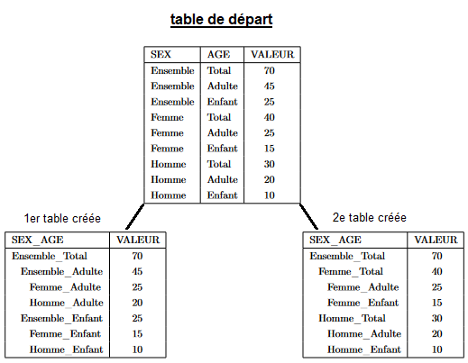
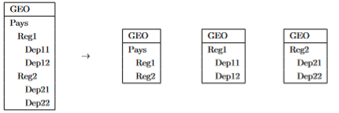

<!--
  NE JAMAIS MODIFIER DIRECTEMENT `rtauargus.Rmd`
  MODIFIER `rtauargus.Rmd.orig` ET EXECUTER `precompilation.R`
  Voir : https://ropensci.org/technotes/2019/12/08/precompute-vignettes
-->


Les algorithmes de pose du secret secondaire tels qu'Optimal ou Modular implémentés
dans `Tau-Argus` reposent sur un programme d'optimisation sous contraintes. Le
nombre de ces constraintes devient très difficile à gérer - du moins dans un temps
raisonnable - pour `Tau-Argus`. La pose du secret
sur un tableau à 5 dimensions directement avec `Tau-Argus` est impossible et les résultats
fournis par le logiciel lors du traitement d'un tableau de 4 dimensions sont
accompagnés d'un avertissement. Par ailleurs, un tableau à 4 dimensions dont l'une
est hiérarchique est un problème, en général, très difficile pour `Tau-Argus`.

Le package `rtauargus` offre désormais la possibilité de protéger des tableaux
de 4 à 5 dimensions. Pour les tableaux de 4 dimensions, la protection est
même plus rapide et permet de traiter des tableaux plus grands encore (en nombre
de lignes). Certains tableaux demeurent néanmoins trop complexes pour `Tau-Argus`.

Cette nouvelle fonctionnalité est mise à disposition dans les fonctions
`tab_rtauargus` et `tab_multi_manager` avec l'argument `split_tab`.
Quand il est renseigné à `TRUE`, les fonctions réduisent
la dimension d'un tableau de 4 ou 5 dimensions en construisant un certain nombre
de tableaux liés de 3 dimensions chacun. Ces tableaux contiennent exactement les
mêmes cellules que le tableau original. Puis, la fonction `tab_multi_manager` est
appelée pour organiser la pose du secret sur l'ensemble de ces tableaux.
`A la fin du processus, on récupère la table de départ - avec ses dimensions
originales - augmentée des informations sur le secret secondaire.

Ainsi, point important à retenir, la pose du secret secondaire est toujours
réalisée par les algorithmes de `Tau-Argus`, le package `rtauargus` ne fait que
découper le tableau en sous-tableaux à trois dimensions et assurer la cohérence
du secret entre ces différents sous-tableaux liés entre eux.

Cette méthode est susceptible de générer plus de secret qu'une attaque directe
du problème. Mais celle-ci étant impossible dans les cas visés, c'est un moindre mal.

Pour utiliser cette fonctionnalité, il est nécessaire que l'utilisateur
pose de lui-même le secret primaire en amont.


### Comment la réduction d'un tableau à 4 ou 5 dimensions est-elle réalisée ?

Pour passer de 5 à 3 dimensions, on utilise deux fois de suite la méthode
utilisée pour réduire un tableau en sous-tableaux ayant une dimension de moins.

Le passage de 4 à 3 dimensions consiste d'abord à fusionner deux des quatre
dimensions du tableau original, c'est-à-dire qu'on remplace deux des variables
de départ par une seule dont les modalités sont la fusion des modalités des
deux variables choisies.

Dans l'exemple ci-dessous, on fusionne par exemple les deux variables `SEX` et
`AGE` pour n'en faire qu'une seule appelée `SEX_AGE`.

<div style="text-align: center;">

</div>

Mais, la nouvelle variable contient des modalités non-emboîtées entre elles,
comme, par exemple, les modalités `Femme_Total` et `Ensemble_Adulte`.

<div style="text-align: center; font-size: 20px;">
    Total_Ensemble = Total_Adulte + Total_Enfant
</div>

<div style="text-align: center; font-size: 20px;">
    Total_Ensemble = Femme_Ensemble + Homme_Ensemble
</div>

Or, nous savons gérer la présence de hiérarchies non-emboîtées dans un tableau.
Il suffit, en effet, de construire les sous-tableaux de même structure de telle
sorte que dans chacun de ces sous-tableaux la variable incriminée soit
restreinte à une partie parfaitement emboîtée de ses modalités.
Pour poser le secret sur les sous-tableaux liés engendrés, il est fait appel
à la fonction `tab_multi_manager`, spécialement conçue pour assurer la cohérence
du secret entre tableaux liés.

Ici, la fusion nécessite la construction de deux sous-tableaux, chacun ayant une
variable `SEX__AGE` parfaitement hiérarchique. Le premier rassemble les modalités
`Total_Ensemble`, `Total_Adulte` et `Total_Enfant`, le second
`Total_Ensemble`, `Femme_Ensemble` et `Homme_Ensemble`.

Cet exemple est le plus simple qu'il soit: en fusionnant deux variables
non hiérarchiques, on est amené à générer deux sous-tableaux.

Lorsque l'une des variables fusionnées est elle-même hiérarchique,
la construction des sous-tableaux s'appuie sur les différents sous-totaux
présents dans la hiérarchie, comme indiqué dans la figure ci-dessous:

<div style="text-align: center;">
  
</div>

### Pour aller plus loin

- [Article présentant la méthode et des résultats de simulation](https://github.com/InseeFrLab/dims_reduction_tables_workshop_20231215)


### Les principaux arguments ajoutés à `tab_rtauargus()` et `tab_multi_manager()`

Pour activer le découpage des tableaux de dimension 4 ou 5 en sous-tableaux
de 3 dimensions, l'utilisateur doit activer l'argument `split_tab` en le passant
à `TRUE`. Cette valeur est sa valeur par défaut. Ainsi, l'utilisateur veillera
à passer cet argument à `FALSE` s'il souhaite qu'un tableau à 4 dimensions soit
traité directement par `Tau-Argus`.

L'argument `nb_tab_option` permet de préciser la façon dont le tableau est découpé:

- L'option `"min"` consiste à construire le minimum de tables à 3 dimensions
lors de la fusion. Ce sont donc des variables non hiérarchiques qui seront
fusionnées en priorité.
- L'option `"max"` au contraire construit le maximum de tables à 3 dimensions possible
lors de la fusion. Ce sont donc des variables hiérarchiques qui seront
fusionnées en priorité. Cette option est intéressante pour réduire la taille
des sous-tableaux produits et donc augmenter les chances que `Tau-Argus` puisse
les traiter. L'inconvénient de cette option est qu'elle peut générer un très
grand nombre de tableaux, nombre dépendant du nombre de noeuds dans les hiérarchies.
- L'option `"smart"` va chercher à construire le minimum de tables à 3 dimensions
tout en cherchant à respecter une limite de taille (nombre de lignes) pour les
sous-tableaux construits. Cette limite est fixée par l'argument `limit`. Par
défaut, la valeur est fixée à `14 700` - choisie de par notre expérience. Si
la limite n'est pas atteignable, un avertissement est affiché mais cela ne bloque
pas la construction des tables et la pose du masque.

Par défaut, l'argument `nb_tab_option` est fixé à `"smart"`. Il est déconseillé
de changer cette valeur dans un premier temps.

- L'argument `nb_tab = "min"` est intéressant en termes de secret car c'est
l'option qui génèrera le moins de sur-secret puisqu'elle construira le moins
possible de sous-tableaux liés. Il peut être intéressant à utiliser si la table
de départ contient un nombre de lignes raisonnables,
c'est-à-dire si chaque dimension n'est pas trop ventilée.
- L'argument `nb_tab = "max"` créant le plus de tableaux possibles engendrera
nécessairement le plus de secret, mais elle pourra aussi convenir quand les
tableaux d'origine sont très longs et nécessitent d'être beaucoup découpés pour
que la pose du secret soit possible avec `Tau-Argus`.

### Exemple

Comme tout est géré par la fonction `tab_rtauargus`, la pose du secret sur un tableau
à 4 ou 5 dimensions n'ajoute pas de difficultés particulières pour l'utilisateur
en réalité.

Nous présentons ici un exemple de pose de secret sur un tableau à 4 dimensions.

#### Préparation des données


```r
library(tictoc)
library(dplyr)
library(rtauargus)
```


```r
options(
  rtauargus.tauargus_exe =
    "Y:/Logiciels/TauArgus/TauArgus4.2.3/TauArgus.exe"
)
```


```r
data("datatest1")
str(datatest1)
#> tibble [689 x 12] (S3: tbl_df/tbl/data.frame)
#>  $ treff         : chr [1:689] "tr1" "tr2" "tr3" "Total" ...
#>  $ cj            : chr [1:689] "Total" "Total" "Total" "PA" ...
#>  $ type_distrib  : chr [1:689] "Total" "Total" "Total" "Total" ...
#>  $ A10           : chr [1:689] "Total" "Total" "Total" "Total" ...
#>  $ nb_obs        : num [1:689] 227093 7803 227 1443 125904 ...
#>  $ pizzas_tot    : num [1:689] 5900938 6538420 6794859 15128 10168928 ...
#>  $ pizzas_max    : num [1:689] 135444 267177 852749 2756 523505 ...
#>  $ is_secret_freq: logi [1:689] FALSE FALSE FALSE FALSE FALSE FALSE ...
#>  $ is_secret_dom : logi [1:689] FALSE FALSE FALSE FALSE FALSE FALSE ...
#>  $ is_secret_prim: logi [1:689] FALSE FALSE FALSE FALSE FALSE FALSE ...
#>  $ nb_obs_rnd    : num [1:689] 227094 7804 228 1444 125905 ...
#>  $ pizzas_tot_abs: num [1:689] 5900938 6538420 6794859 15128 10168928 ...
#>  - attr(*, ".internal.selfref")=<externalptr>
```


#### Préparation des arguments pour `tab_rtauargus`


```r

totcode <- c(treff ="Total",cj ="Total", A10 = "Total", type_distrib ="Total")
explanatory_vars<- names(totcode)
```

#### Pose du secret primaire


```r
datatest1_with_prim <- datatest1 %>%
    mutate(
      is_secret_freq = (nb_obs > 0 & nb_obs < 3),
      is_secret_dom = (pizzas_tot != 0) & (pizzas_max > 0.85*pizzas_tot),
      pizzas_tot= round(abs(pizzas_tot),2)
    ) %>%
    mutate(
      is_secret_prim =  is_secret_freq ,
      nb_obs = ceiling(nb_obs)
    )
```

#### Pose du secret secondaire avec `rtauargus`

Pour poser le secret secondaire, on utilise la fonction `tab_rtauargus` avec
l'argument `split_tab = TRUE`. Ainsi, `Tau-Argus` n'aura pas à traiter directement
le secret sur la table à 4 dimensions. La fonction `tab_rtauargus` va
découper la table originale en un certain nombre de tables qui seront protégées
comme des tables liées avec un appel sous-jacent à `tab_multi_manager`.


```r
tictoc::tic()
res_wi_split <- tab_rtauargus(
    tabular = datatest1_with_prim,
    files_name = "datatest1",
    dir_name = "example_1",
    explanatory_vars = explanatory_vars,
    totcode = totcode,
    value = "pizzas_tot",
    freq = "nb_obs",
    secret_var = "is_secret_prim",
    verbose = TRUE,
    split_tab = TRUE
)
#> 
#> Reducing dims...
#>  tab 
#> 
#> Choosing variables...
#> 
#> Reducing from 4 to 3...
#> tab has generated 2 tables in total
#> 
#> Spliting...
#>  treff___cj 
#> tab has generated 2 tables in total
#> 
#> --- Current table to treat:  tab1 ---
#> --- Current table to treat:  tab2 ---
#> --- Current table to treat:  tab1 ---
#> --- Current table to treat:  tab2 ---
#> --- Current table to treat:  tab1 ---
tictoc::toc()
#> 45.31 sec elapsed
```

La réduction de dimensions a conduit à construire deux sous-tableaux de 3
dimensions à partir du tableau original.


```r
str(res_wi_split)
#> 'data.frame':	689 obs. of  17 variables:
#>  $ treff         : chr  "Total" "tr1" "tr1" "tr1" ...
#>  $ cj            : chr  "Total" "LL" "SP" "Total" ...
#>  $ type_distrib  : chr  "1" "1" "1" "1" ...
#>  $ A10           : chr  "AZ" "AZ" "AZ" "AZ" ...
#>  $ nb_obs        : num  115 89 21 110 6 ...
#>  $ pizzas_tot    : num  8447 769 1301 532 7915 ...
#>  $ pizzas_max    : num  1471.2 13.8 96.4 96.4 1471.2 ...
#>  $ is_secret_freq: logi  FALSE FALSE FALSE FALSE FALSE FALSE ...
#>  $ is_secret_dom : logi  FALSE TRUE FALSE FALSE FALSE FALSE ...
#>  $ is_secret_prim: logi  FALSE FALSE FALSE FALSE FALSE FALSE ...
#>  $ nb_obs_rnd    : num  115 89 21 110 6 ...
#>  $ pizzas_tot_abs: num  8447 769 1301 532 7915 ...
#>  $ is_secret_1   : logi  FALSE TRUE FALSE TRUE TRUE TRUE ...
#>  $ is_secret_2   : logi  FALSE TRUE TRUE TRUE TRUE TRUE ...
#>  $ is_secret_3   : logi  FALSE TRUE TRUE TRUE TRUE TRUE ...
#>  $ is_secret_4   : logi  FALSE TRUE TRUE TRUE TRUE TRUE ...
#>  $ is_secret_5   : logi  FALSE TRUE TRUE TRUE TRUE TRUE ...
```


```r
stats_wi_split <- res_wi_split %>%
    rename_with( ~"final_suppress", last_col()) %>%
    mutate(
      flag = case_when(
        is_secret_freq ~ "A",
        is_secret_dom ~ "B",
        final_suppress ~ "D",
        TRUE ~"V"
      )
    ) %>%
    count(flag)
stats_wi_split
#>   flag   n
#> 1    A  79
#> 2    B  35
#> 3    D 278
#> 4    V 297
```

Avec l'option de découpage du tableau de départ, la pose du secret sur
le tableau à 4 dimensions génère
278 suppressions secondaires.

#### Comparaison avec une pose du secret sans réduire la dimension de la table

`Tau-Argus` est en capacité de poser le secret secondaire sur un tableau à 4
dimensions avec `Modular`, mais, en plus d'émettre un avertissement sur le
fait qu'avec ce nombre de dimensions, la qualité du résultat n'est pas garantie,
il est aussi beaucoup plus long à poser le secret secondaire que lorsqu'il
traite deux tables liées issues du tableau original.


```r
tictoc::tic()
res_wo_split <- tab_rtauargus(
    tabular = datatest1_with_prim,
    files_name = "datatest1",
    dir_name = "example_1/wo_split",
    explanatory_vars = explanatory_vars,
    totcode = totcode,
    value = "pizzas_tot",
    freq = "nb_obs",
    secret_var = "is_secret_prim",
    verbose = TRUE,
    split_tab = FALSE
)
#> Warning :
#> It is highly recommended to use split_tab = TRUE when using rtauargus with 4 or 5 dimensions tables.
#> It allows to split the table in several tables with 3 dimensions.
#> 
#> With split_tab = FALSE, tauargus treats the table in 4 or 5 dimensions.
#> In this case, the secondary secret may not being optimal according to tauargus itself
#> and the process may take longer.
#> Start of batch procedure; file: Z:\SDC\OutilsConfidentialite\rtauargus\vignettes\example_1\wo_split\datatest1.arb
#> <OPENTABLEDATA> "Z:\SDC\OutilsConfidentialite\rtauargus\vignettes\example_1\wo_split\datatest1.tab"
#> <OPENMETADATA> "Z:\SDC\OutilsConfidentialite\rtauargus\vignettes\example_1\wo_split\datatest1.rda"
#> <SPECIFYTABLE> "treff""cj""A10""type_distrib"|"pizzas_tot"||
#> <SAFETYRULE> MAN(10)
#> <READTABLE> 1
#> Tables have been read
#> <APRIORI> "Z:\SDC\OutilsConfidentialite\rtauargus\vignettes\example_1\wo_split\datatest1.hst",1,",",0,0
#> Apriory file: Z:\SDC\OutilsConfidentialite\rtauargus\vignettes\example_1\wo_split\datatest1.hst has been applied
#>                    to table: treff x cj x A10 x type_distrib | pizzas_tot
#> Apriori file Z:\SDC\OutilsConfidentialite\rtauargus\vignettes\example_1\wo_split\datatest1.hst has been read
#> <SUPPRESS> MOD(1,5,1,0,0)
#> Start of the modular protection for table treff x cj x A10 x type_distrib | pizzas_tot
#> WARNING: The table has 4 dimensions.
#>                    Running Modular can take a lot of time and maybe it is difficult to obtain a correct result.
#>                    Please check the results carefully.
#>                    
#> End of modular protection. Time used 301 seconds
#>                    Number of suppressions: 291
#> <WRITETABLE> (1,4,,"Z:\SDC\OutilsConfidentialite\rtauargus\vignettes\example_1\wo_split\datatest1.csv")
#> Table: treff x cj x A10 x type_distrib | pizzas_tot has been written
#>                    Output file name: Z:\SDC\OutilsConfidentialite\rtauargus\vignettes\example_1\wo_split\datatest1.csv
#> End of TauArgus run
tictoc::toc()
#> 306.34 sec elapsed
```

Avec seulement 689 lignes et aucune variable hiérarchique, la pose directe du
secret prend environ 5 minutes à `Tau-Argus`.


```r
stats_wo_split <- res_wo_split %>%
    mutate(
      flag = case_when(
        is_secret_freq ~ "A",
        is_secret_dom ~ "B",
        TRUE ~ Status
      )
    ) %>%
    count(flag)
stats_wo_split
#>   flag   n
#> 1    A  79
#> 2    B  35
#> 3    D 265
#> 4    V 310
```

La pose directe du secret sur le tableau à 4 dimensions génère
265 suppressions secondaires.


On peut observer que le traitement de la table à 4 dimensions directement
génère un masque un peu moins chargé en secret: 266 cellules en secret secondaire,
contre 278 avec une réduction de dimensions.

Il est difficile d'anticiper cette différence puisqu'elle est très dépendante
de la structuration des données, de la présence du secret primaire au sein du
tableau original et de la façon dont les sous-tableaux vont être construits.


## Détail de la vignette

- Authors: **<a> Wistan Pomel </a>** & **<a> Andre-Raymond Socard </a>** &
**<a href="mailto:julien.jamme@insee.fr">Julien Jamme</a>** &
**<a>Nathanael Rastout</a>**
- Last update: **11/01/2024**
- Version of rtauargus used: **1.2.0**
- Version of &tau;-Argus used : **TauArgus 4.2.3**
- R version used :  **4.2.3**

  <p style="text-align: right">
  <a href="#TOC" title="Back to summary">summary &uarr;</a>
  </p>

