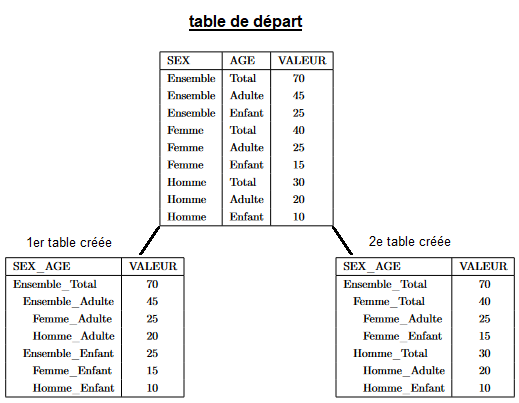
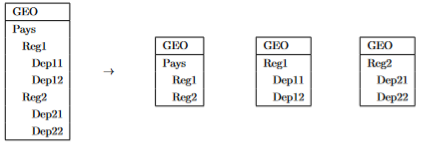

<!--
  NE JAMAIS MODIFIER DIRECTEMENT `rtauargus.Rmd`
  MODIFIER `rtauargus.Rmd.orig` ET EXECUTER `precompilation.R`
  Voir : https://ropensci.org/technotes/2019/12/08/precompute-vignettes
-->


Les algorithmes de pose du secret secondaire tels qu'Optimal ou Modular implémentés
dans `Tau-Argus` reposent sur un programme d'optimisation sous contraintes. Le
nombre de ces contraintes devient très difficile à gérer - du moins dans un temps
raisonnable - pour `Tau-Argus`. La pose du secret
sur un tableau à 5 dimensions directement avec `Tau-Argus` est impossible et les résultats
fournis par le logiciel lors du traitement d'un tableau de 4 dimensions sont
accompagnés d'un avertissement. Par ailleurs, un tableau à 4 dimensions dont l'une
est hiérarchique est un problème, en général, très difficile pour `Tau-Argus`.

Le package `rtauargus` offre désormais la possibilité de protéger des tableaux
de 4 à 5 dimensions. Pour les tableaux de 4 dimensions, la protection est
même plus rapide et permet de traiter des tableaux plus grands encore (en nombre
de lignes). Certains tableaux demeurent néanmoins trop complexes pour `Tau-Argus`.

Cette nouvelle fonctionnalité est mise à disposition dans les fonctions
`tab_rtauargus` et `tab_multi_manager` avec l'argument `split_tab`.
Quand il est renseigné à `TRUE`, les fonctions réduisent
la dimension d'un tableau de 4 ou 5 dimensions en construisant un certain nombre
de tableaux liés de 3 dimensions chacun. Ces tableaux contiennent exactement les
mêmes cellules que le tableau original. Puis, la fonction `tab_multi_manager` est
appelée pour organiser la pose du secret sur l'ensemble de ces tableaux.
À la fin du processus, on récupère la table de départ - avec ses dimensions
originales - augmentée des informations sur le secret secondaire.

Ainsi, point important à retenir, la pose du secret secondaire est toujours
réalisée par les algorithmes de `Tau-Argus`, le package `rtauargus` ne fait que
découper le tableau en sous-tableaux à trois dimensions et assurer la cohérence
du secret entre ces différents sous-tableaux liés entre eux.

Cette méthode est susceptible de générer plus de secret qu'une attaque directe
du problème. Mais celle-ci étant impossible dans les cas visés, c'est un moindre mal.

Pour utiliser cette fonctionnalité, il est nécessaire que l'utilisateur
pose de lui-même le secret primaire en amont.


## Comment la réduction d'un tableau à 4 ou 5 dimensions est-elle réalisée ?

Pour passer de 5 à 3 dimensions, on utilise deux fois de suite la méthode
utilisée pour réduire un tableau en sous-tableaux ayant une dimension de moins.

Le passage de 4 à 3 dimensions consiste d'abord à fusionner deux des quatre
dimensions du tableau original, c'est-à-dire qu'on remplace deux des variables
de départ par une seule dont les modalités sont la fusion des modalités des
deux variables choisies.

Dans l'exemple ci-dessous, on fusionne par exemple les deux variables `SEX` et
`AGE` pour n'en faire qu'une seule appelée `SEX_AGE`.

<div style="text-align: center;">

</div>

Mais, la nouvelle variable contient des modalités non-emboîtées entre elles,
comme, par exemple, les modalités `Femme_Total` et `Ensemble_Adulte`.

<div style="text-align: center; font-size: 20px;">
    Total_Ensemble = Total_Adulte + Total_Enfant
</div>

<div style="text-align: center; font-size: 20px;">
    Total_Ensemble = Femme_Ensemble + Homme_Ensemble
</div>

Or, nous savons gérer la présence de hiérarchies non-emboîtées dans un tableau.
Il suffit, en effet, de construire les sous-tableaux de même structure de telle
sorte que dans chacun de ces sous-tableaux la variable incriminée soit
restreinte à une partie parfaitement emboîtée de ses modalités.
Pour poser le secret sur les sous-tableaux liés engendrés, il est fait appel
à la fonction `tab_multi_manager`, spécialement conçue pour assurer la cohérence
du secret entre tableaux liés.

Ici, la fusion nécessite la construction de deux sous-tableaux, chacun ayant une
variable `SEX__AGE` parfaitement hiérarchique. Le premier rassemble les modalités
`Total_Ensemble`, `Total_Adulte` et `Total_Enfant`, le second
`Total_Ensemble`, `Femme_Ensemble` et `Homme_Ensemble`.

Cet exemple est le plus simple qu'il soit: en fusionnant deux variables
non hiérarchiques, on est amené à générer deux sous-tableaux.

Lorsque l'une des variables fusionnées est elle-même hiérarchique,
la construction des sous-tableaux s'appuie sur les différents sous-totaux
présents dans la hiérarchie, comme indiqué dans la figure ci-dessous:

<div style="text-align: center;">
  
</div>

## Pour aller plus loin

- [Article présentant la méthode et des résultats de simulation](https://github.com/InseeFrLab/dims_reduction_tables_workshop_20231215)


## Les principaux arguments ajoutés à `tab_rtauargus()` et `tab_multi_manager()`

Pour activer le découpage des tableaux de dimension 4 ou 5 en sous-tableaux de 3 dimensions,
l'utilisateur doit activer l'argument `split_tab = TRUE` (valeur par défaut).
L'utilisateur veillera à passer cet argument à `FALSE` s'il souhaite qu'un tableau à
4 dimensions soit traité directement par `Tau-Argus`.

L'argument `nb_tab_option` permet de préciser la façon dont le tableau est découpé :

- **`nb_tab_option = "smart"` (option recommandée et par défaut) :** Cherche à générer
le minimum de sous-tableaux tout en cherchant à respecter une taille maximale de sous-tableau
fixée par l'argument `limit` (par défaut `14 700` lignes).

- **`nb_tab_option = "min"` :** Construit le minimum absolu de sous-tableaux à 3 dimensions,
sans contrainte sur la taille des sous-tableaux produits.

- **`nb_tab_option = "max"` (déconseillée) :** Tente de construire le maximum de
sous-tableaux possible. Cette option génère un sur-secret important et est aujourd'hui
déconseillée au profit de l'option `"smart"`.

> 💡 **Pour en savoir plus sur le fonctionnement détaillé de ces options,
l'impact sur le temps de calcul et le choix de la valeur de `limit`, consultez la section
[Comment choisir le nombre de tableaux à générer lors de la réduction de dimension ?](#choix-nb-tableaux)
en fin de vignette.**

## Exemple

Comme tout est géré par la fonction `tab_rtauargus`, la pose du secret sur un tableau
à 4 ou 5 dimensions n'ajoute pas de difficultés particulières pour l'utilisateur
en réalité.

Nous présentons ici un exemple de pose de secret sur un tableau à 4 dimensions.

> ⚠️ **Avertissement concernant les temps d'exécution**
>
> Des optimisations majeures ont été apportées à la fonction `tab_multi_manager()`
(utilisée lors du traitement des tableaux issus de la réduction de dimension) avec
la version 1.3.5 de rtauargus publié à l'été 2026.
Ainsi, si vous avez utilisé cette fonctionnalité par le passé, les performances
ressenties côté utilisateur peuvent radicalement changer.
>
> La méthode avec découpage est aujourd'hui **nettement plus rapide** que par le passé,
et ce gain de performance est d'autant plus important que le nombre de sous-tableaux générés est grand.
> Par exemple, sur une table test qui générait 60 sous-tables, le temps d'éxécution est passé
de 5h à 3h. Les ressources en RAM ont également été optimisées.

### Préparation des données


``` r
library(tictoc)
library(dplyr)
library(rtauargus)
```


``` r
options(
  rtauargus.tauargus_exe =
    "Y:/Logiciels/TauArgus/TauArgus4.2.3/TauArgus.exe"
)
```


``` r
data("datatest1")
str(datatest1)
#> tibble [689 x 12] (S3: tbl_df/tbl/data.frame)
#>  $ treff         : chr [1:689] "tr1" "tr2" "tr3" "Total" ...
#>  $ cj            : chr [1:689] "Total" "Total" "Total" "PA" ...
#>  $ type_distrib  : chr [1:689] "Total" "Total" "Total" "Total" ...
#>  $ A10           : chr [1:689] "Total" "Total" "Total" "Total" ...
#>  $ nb_obs        : num [1:689] 227093 7803 227 1443 125904 ...
#>  $ pizzas_tot    : num [1:689] 5900938 6538420 6794859 15128 10168928 ...
#>  $ pizzas_max    : num [1:689] 135444 267177 852749 2756 523505 ...
#>  $ is_secret_freq: logi [1:689] FALSE FALSE FALSE FALSE FALSE FALSE ...
#>  $ is_secret_dom : logi [1:689] FALSE FALSE FALSE FALSE FALSE FALSE ...
#>  $ is_secret_prim: logi [1:689] FALSE FALSE FALSE FALSE FALSE FALSE ...
#>  $ nb_obs_rnd    : num [1:689] 227094 7804 228 1444 125905 ...
#>  $ pizzas_tot_abs: num [1:689] 5900938 6538420 6794859 15128 10168928 ...
#>  - attr(*, ".internal.selfref")=<externalptr>
```


### Préparation des arguments pour `tab_rtauargus`


``` r

totcode <- c(treff ="Total",cj ="Total", A10 = "Total", type_distrib ="Total")
explanatory_vars<- names(totcode)

```

### Pose du secret primaire


``` r
datatest1_with_prim <- datatest1 %>%
    mutate(
      is_secret_freq = (nb_obs > 0 & nb_obs < 3),
      is_secret_dom = (pizzas_tot != 0) & (pizzas_max > 0.85*pizzas_tot),
      pizzas_tot= round(abs(pizzas_tot),2)
    ) %>%
    mutate(
      is_secret_prim =  is_secret_freq ,
      nb_obs = ceiling(nb_obs)
    )
```

### Pose du secret secondaire avec `rtauargus`

Pour poser le secret secondaire, on utilise la fonction `tab_rtauargus` avec
l'argument `split_tab = TRUE`. Ainsi, `Tau-Argus` n'aura pas à traiter directement
le secret sur la table à 4 dimensions. La fonction `tab_rtauargus` va
découper la table originale en un certain nombre de tables qui seront protégées
comme des tables liées avec un appel sous-jacent à `tab_multi_manager`.


``` r
tictoc::tic()
res_wi_split <- tab_rtauargus(
    tabular = datatest1_with_prim,
    files_name = "datatest1",
    dir_name = "example_1",
    explanatory_vars = explanatory_vars,
    totcode = totcode,
    value = "pizzas_tot",
    freq = "nb_obs",
    secret_var = "is_secret_prim",
    verbose = TRUE,
    split_tab = TRUE
)
#> 
#> Reducing dims...
#>  tab 
#> 
#> Choosing variables...
#> 
#> Reducing from 4 to 3...
#> tab has generated 2 tables in total
#> 
#>   Table size distribution :
#>    Min. 1st Qu.  Median    Mean 3rd Qu.    Max. 
#>   535.0   536.5   538.0   538.0   539.5   541.0 
#> 
#> 
#> 
--- Current table to treat: tab1 | loop iter : 1 ---            
--- Current table to treat: tab2 | loop iter : 2 ---            
--- Current table to treat: tab1 | loop iter : 3 ---            
--- Current table to treat: tab2 | loop iter : 4 ---            
--- Current table to treat: tab1 | loop iter : 5 ---
tictoc::toc()
#> 46.35 sec elapsed
```

La réduction de dimensions a conduit à construire deux sous-tableaux de 3
dimensions à partir du tableau original.


``` r
str(res_wi_split)
#> 'data.frame':	689 obs. of  13 variables:
#>  $ treff         : chr  "tr1" "tr2" "tr3" "Total" ...
#>  $ cj            : chr  "Total" "Total" "Total" "Total" ...
#>  $ type_distrib  : chr  "Total" "Total" "Total" "2" ...
#>  $ A10           : chr  "Total" "Total" "Total" "Total" ...
#>  $ nb_obs        : num  227094 7804 228 77736 110405 ...
#>  $ pizzas_tot    : num  5900938 6538420 6794859 6692768 9280934 ...
#>  $ pizzas_max    : num  135444 267177 852749 852749 523505 ...
#>  $ is_secret_freq: logi  FALSE FALSE FALSE FALSE FALSE FALSE ...
#>  $ is_secret_dom : logi  FALSE FALSE FALSE FALSE FALSE FALSE ...
#>  $ is_secret_prim: logi  FALSE FALSE FALSE FALSE FALSE FALSE ...
#>  $ nb_obs_rnd    : num  227094 7804 228 77736 110405 ...
#>  $ pizzas_tot_abs: num  5900938 6538420 6794859 6692768 9280934 ...
#>  $ is_secret_5   : logi  FALSE FALSE FALSE FALSE FALSE FALSE ...
```


``` r
stats_wi_split <- res_wi_split %>%
    rename_with( ~"final_suppress", last_col()) %>%
    mutate(
      flag = case_when(
        is_secret_freq ~ "A",
        is_secret_dom ~ "B",
        final_suppress ~ "D",
        TRUE ~"V"
      )
    ) %>%
    count(flag)
stats_wi_split
#>   flag   n
#> 1    A  79
#> 2    B  35
#> 3    D 280
#> 4    V 295
```

Avec l'option de découpage du tableau de départ, la pose du secret sur
le tableau à 4 dimensions génère
280 suppressions secondaires.

### Comparaison avec une pose du secret sans réduire la dimension de la table

`Tau-Argus` est en capacité de poser le secret secondaire sur un tableau à 4
dimensions avec `Modular`, mais, en plus d'émettre un avertissement sur le
fait qu'avec ce nombre de dimensions, la qualité du résultat n'est pas garantie,
il est aussi beaucoup plus long à poser le secret secondaire que lorsqu'il
traite deux tables liées issues du tableau original.


``` r
tictoc::tic()
res_wo_split <- tab_rtauargus(
    tabular = datatest1_with_prim,
    files_name = "datatest1",
    dir_name = "example_1/wo_split",
    explanatory_vars = explanatory_vars,
    totcode = totcode,
    value = "pizzas_tot",
    freq = "nb_obs",
    secret_var = "is_secret_prim",
    verbose = TRUE,
    split_tab = FALSE
)
#> Warning :
#> It is highly recommended to use split_tab = TRUE when using rtauargus with 4 or 5 dimensions tables.
#> It allows to split the table in several tables with 3 dimensions.
#> 
#> With split_tab = FALSE, tauargus treats the table in 4 or 5 dimensions.
#> In this case, the secondary secret may not being optimal according to tauargus itself
#> and the process may take longer.
#> Start of batch procedure; file: Z:\rtauargus\vignettes\example_1\wo_split\datatest1.arb
#> <OPENTABLEDATA> "Z:\rtauargus\vignettes\example_1\wo_split\datatest1.tab"
#> <OPENMETADATA> "Z:\rtauargus\vignettes\example_1\wo_split\datatest1.rda"
#> <SPECIFYTABLE> "treff""cj""A10""type_distrib"|"pizzas_tot"||
#> <SAFETYRULE> MAN(10)
#> <READTABLE> 1
#> Tables have been read
#> <APRIORI> "Z:\rtauargus\vignettes\example_1\wo_split\datatest1.hst",1,",",0,0
#> Apriory file: Z:\rtauargus\vignettes\example_1\wo_split\datatest1.hst has been applied
#>                    to table: treff x cj x A10 x type_distrib | pizzas_tot
#> Apriori file Z:\rtauargus\vignettes\example_1\wo_split\datatest1.hst has been read
#> <SUPPRESS> MOD(1,5,1,0,0)
#> Start of the modular protection for table treff x cj x A10 x type_distrib | pizzas_tot
#> WARNING: The table has 4 dimensions.
#>                    Running Modular can take a lot of time and maybe it is difficult to obtain a correct result.
#>                    Please check the results carefully.
#>                    
#> End of modular protection. Time used 300 seconds
#>                    Number of suppressions: 293
#> <WRITETABLE> (1,4,,"Z:\rtauargus\vignettes\example_1\wo_split\datatest1.csv")
#> Table: treff x cj x A10 x type_distrib | pizzas_tot has been written
#>                    Output file name: Z:\rtauargus\vignettes\example_1\wo_split\datatest1.csv
#> End of TauArgus run
tictoc::toc()
#> 305.1 sec elapsed
```

Avec seulement 689 lignes et aucune variable hiérarchique, la pose directe du
secret prend environ 5 minutes à `Tau-Argus`.


``` r
stats_wo_split <- res_wo_split %>%
    mutate(
      flag = case_when(
        is_secret_freq ~ "A",
        is_secret_dom ~ "B",
        TRUE ~ Status
      )
    ) %>%
    count(flag)
stats_wo_split
#>   flag   n
#> 1    A  79
#> 2    B  35
#> 3    D 268
#> 4    V 307
```

La pose directe du secret sur le tableau à 4 dimensions génère
268 suppressions secondaires.


On peut observer que le traitement de la table à 4 dimensions directement
génère un masque un peu moins chargé en secret: 268 cellules en secret secondaire,
contre 280 avec une réduction de dimensions.

Il est difficile d'anticiper cette différence puisqu'elle est très dépendante
de la structuration des données, de la présence du secret primaire au sein du
tableau original et de la façon dont les sous-tableaux vont être construits.

## Choix avancé du nombre de tableaux et paramétrage de `limit`

### Comment choisir le nombre de tableaux à générer lors de la réduction de dimension ? {#choix-nb-tableaux}

Lors de la réduction de dimension, il est possible de choisir plusieurs valeurs
pour l'argument `nb_tab_option`.

De manière historique, les options `"min"` et `"max"` ont été créées pour générer
respectivement le minimum ou le maximum de sous-tableaux via le choix des variables à fusionner.

L'option `"smart"` a été développée par la suite et constitue **la valeur recommandée en pratique**.
Elle calcule, pour chaque possibilité de variables à fusionner, le nombre de tableaux
qui seront générés ainsi que leurs tailles. Elle s'utilise conjointement avec l'argument `limit`,
qui fixe une taille maximale théorique par sous-tableau (par exemple `limit = 20000L`).

L'option `"smart"` cherche à fusionner les variables de manière à **minimiser le nombre de tableaux générés**,
sous la contrainte que chaque tableau ait une taille inférieure à `limit` (si possible) :

- Si la valeur de `limit` n'est pas contraignante (par exemple si `limit` est supérieur au
nombre de lignes du tableau initial), `"smart"` générera le moins de tables possible.

- Contrairement à l'option `"min"`, si plusieurs choix de variables mènent au même nombre de tables,
`"smart"` privilégiera le choix qui **minimise la taille des tables générées**
(alors que `"min"` ne garantit que le nombre de tables, sans considération pour leur taille).
En ce sens, `"smart"` inclut les avantages de `"min"` avec une meilleure qualité d'optimisation.

- Concernant l'option `"max"`, elle cherche à maximiser le nombre de tables générées.
En 4 dimensions, elle générera bien le nombre maximal de tables. Néanmoins, en 5 dimensions,
elle ne maximise pas toujours le nombre total de sous-tableaux, car générer
moins de tables au passage de 5 à 4 dimensions permet parfois d'en générer beaucoup
plus lors du passage de 4 à 3 dimensions. En pratique, l'usage de `"max"`
(ou d'un équivalent `"smart"` avec un `limit` très faible comme `1L`) est **fortement déconseillé**.

---

### Le compromis entre qualité du secret et temps d'exécution

Le choix de la valeur de `limit` et du nombre de sous-tables générées repose sur un compromis :

1. **Un découpage modéré améliore la vitesse et la qualité du secret :**

  En réduisant la taille des tables et le nombre de variables hiérarchiques par sous-tableau,
  le solveur (*Tau-Argus*) converge plus facilement. Cela permet souvent d'accélérer
  le calcul (notamment en *Modular*) tout en **réduisant le sur-masquage secondaire**.

2. **Un sur-découpage devient contre-productif :** Si le nombre de sous-tableaux
devient trop grand (dépassant une centaine de tables) :

   - **Le temps d'exécution explose** en raison du coût de gestion des fichiers (I/O)
   et des itérations de réconciliation entre tables (`tab_multi_manager`).

   - **La qualité du secret peut se dégrader** car la sur-fragmentation fait perdre
   la vision globale au traitement, pouvant imposer des masques redondants entre sous-tables.

---

### Démarche recommandée en pratique

Les expérimentations sur les benchmarks 4D et 5D démontrent qu'il
**ne faut pas chercher à générer le minimum absolu de sous-tableaux**.
Au contraire, un découpage modéré apporte un gain de temps spectaculaire
(particulièrement avec le solveur *Modular*, où le temps passe de plusieurs
heures à quelques dizaines de minutes) tout en réduisant le sur-masquage secondaire.

La démarche empirique recommandée s'articule ainsi :

1. **Explorer les scénarios avec `explore_reduce_dims()` :**

   Avant d'exécuter la recherche du secret, utilisez la fonction `explore_reduce_dims()`.
   Sans générer de fichiers ni lancer *Tau-Argus*, elle calcule analytiquement
   l'ensemble des combinaisons de découpage possibles (6 combinaisons en 4D, 25 en 5D).
   Elle renvoie un tableau récapitulatif contenant :

   - `nb_tab` : le nombre de sous-tables générées.

   - `nb_hrc` : le nombre de variables hiérarchiques restant dans les sous-tables.

   - `min_size`, `med_size`, `max_size` : la taille minimale, médiane et maximale des sous-tables (en nombre de lignes).

2. **Fixer la taille cible `limit` selon le solveur retenu :**

   En observant la colonne `max_size` renvoyée par `explore_reduce_dims()`,
   choisissez l'option `nb_tab_option = "smart"` avec une valeur de `limit`
   correspondant à la taille maximale de la configuration visée :

   - **Avec Modular :** Repérez les lignes réduisant `nb_hrc` à
   **1 ou 2 variables hiérarchiques** (généralement entre 15 et 30 tables de ~15 000 à 30 000 lignes)
   et fixez `limit` à cette valeur maximale. C'est la zone optimale pour
   faire chuter le temps de calcul tout en obtenant le masque le plus fin.

   - **Avec Hypercube :** Si la vitesse est votre contrainte principale,
   le traitement direct (`split_tab = FALSE`) ou la solution minimale restent
   très rapides. Un découpage intermédiaire permettra toutefois d'améliorer la qualité du masque.

3. **Ajuster sans sur-découper :**
   - Si le solveur échoue (manque de mémoire ou non-convergence),
   diminuez légèrement la valeur de `limit` pour passer au palier de découpage inférieur.

   - **Attention au sur-découpage :** Évitez de fixer un `limit` trop faible qui
   générerait plusieurs centaines de sous-tables (ex: > 100 tables).
   La sur-fragmentation entraîne un coût élevé de gestion des fichiers (I/O) et
   d'itérations d'harmonisation (`tab_multi_manager`), devenant contre-productive.


> **Remarque mathématique :** Pour réduire un tableau de 4 à 3 dimensions en fusionnant deux variables,
> il existe 6 combinaisons de fusions possibles (ce qui correspond
> au [nombre de Stirling de seconde espèce](https://fr.wikipedia.org/wiki/Nombre_de_Stirling#Nombre_de_Stirling_de_seconde_esp%C3%A8ce) *S*(4, 3) = 6).
> Pour passer directement de 5 à 3 dimensions, ce nombre s'élève à *S*(5, 3) = 25 combinaisons.
> La fonction `explore_reduce_dims()` évalue ces différentes possibilités pour retenir le découpage
> le plus judicieux selon l'option choisie.


Voici un exemple ci-dessous

``` r
library(rtauargus)

load("../data/input_data_5d.RData") # dfs5_agg, tot5, hrc5

dfs5_agg %>% colnames() %>% print()
#> [1] "SEX"            "AGE"            "GEO"            "ACT"            "ECO"            "VALUE"         
#> [7] "freq"           "is_secret_prim" "secret_no_pl"
dfs5_agg %>% dplyr::tally() %>% print()
#> # A tibble: 1 x 1
#>        n
#>    <int>
#> 1 475200

# ======================================================================
# Détail des modalités par variable (Totaux inclus) :
#  - ACT : 25 modalités (1 Total + 4 groupes + 20 sous-niveaux)
#  - GEO : 36 modalités (1 Total + 5 régions + 30 sous-régions)
#  - SEX : 11 modalités (1 Total + 10 modalités fines)
#  - AGE : 16 modalités (1 Total + 15 modalités fines)
#  - ECO :  3 modalités (1 Total +  2 modalités fines)
# ======================================================================

explore_reduce_dims(dfs = dfs5_agg,
                    totcode = tot5,
                    hrcfiles = hrc5)
#>    nb_tab nb_hrc min_size med_size max_size
#> 1      20      3    63756    77688    95616
#> 2      20      3    53460    73494   101016
#> 3      20      3    53820    75348   101556
#> 4      24      3    52325    63325    78850
#> 5      24      3    46200    61488    81650
#> 6      24      3    46575    61862    82150
#> 7      54      3    20700    27900    41400
#> 8     120      2     9856    14768    18176
#> 9     120      2     9200    13616    18352
#> 10    120      2    12075    17630    18426
#> 11    120      2     9360    14640    18544
#> 12    120      2     9801    15158    18656
#> 13    120      2     9075    13431    18722
#> 14    120      2     9295    15015    19019
#> 15    120      2    10920    16953    19383
#> 16    120      2    10935    17202    19398
#> 17    168      2     6336     9216    17856
#> 18    214      2     5200     7600    12400
#> 19    218      2     4356     6336    18216
#> 20    270      2     4860     6588     9828
#> 21    274      2     3575     5225    12650
#> 22    324      2     4200     5325     7950
#> 23    758      1     1936     2640     3344
#> 24   1070      1     1200     1776     2928
#> 25   1370      1      825     1221     3003
```

Par exemple, dans l'exemple ci-dessous, entre 20 et 54 tables, les sous-tables ont 3 variables hierarchiques ;
entre 120 et 324 sous tables, 2 variables hierarchiques ; et de 758 à 1370 tables, 1 variable hierarchique.

Dans un premier temps, on pourrait commencer par choisir de partir sur un split de 120 sous-tables.
Cela semble un bon compromis.
Les tables ne font que 18176 lignes maximum (en choissisant limit = 18200 par exemple),
ce qui devrait simplifier grandement la pose du secret par Tau-Argus.
De plus, le passage de 54 tables à 120 tables à un enjeu double. Outre la réduction de la taille des lignes,
(diminution de moitié), c'est principalement la diminution du nombre de variables hierarchiques qui pourrait aider grandement Tau-Argus.

De manière empirique, on pourrait ensuite éventuellement tester d'autres configurations (par exemple 54 sous-tables, 168 et 270 sous-tables)
afin de voir si d'autres configuration peuvent nous apporter un meilleur secret, ou un temps d'éxécution plus raisonnable.

### Synthèse comparative des performances selon la valeur de `limit`

D'un point de vue méthodologique, on peut se demander quel est l'impact de `limit` sur le nombre de tables,
le temps d'éxecution, ainsi que le secret généré. Ci-dessous une synthèse sur une table à 4 dimensions est proposée.

#### Table initiale et résultats Tau-Argus

```
======================================================================
Nombre de lignes de la table : 124800
Détail des modalités par variable (Totaux inclus) :
  - ACT : 65 modalités (1 Total + 8 groupes + 8 * 7 sous-niveaux)
  - GEO : 64 modalités (1 Total + 7 régions + 7 * 8 sous-régions)
  - SEX : 6 modalités (1 Total + 5 modalités fines)
  - AGE : 5 modalités (1 Total + 4 modalités fines)
======================================================================
```

La table contient 9.8% de secret primaire.

##### 1. Résultats avec la méthode **HYPERCUBE** (`GH(1,100)`)

| Variant | Nb tables | Taille max (lignes) | Temps d'exéc. | Mémoire max | % cellules masquées | % valeur masquée |
| :--- | :---: | :---: | :---: | :---: | :---: | :---: |
| **`no_split`**<br>*(sans réduction)* | 1 | 124 800 | 2min 55s<br>(175 s) | NA | 26,60 % | 1,28 % |
| **`min`** | 2 | 108 160 | 10min 06s<br>(606 s) | 521,8 MB | 28,40 % | 1,34 % |
| **`smart_108000`** | 16 | 15 925 | 12min 46s<br>(766 s) | 451,6 MB | 25,58 % | 1,19 % |
| **`smart_15800`** | 18 | 15 680 | 12min 22s<br>(742 s) | 384,4 MB | 25,84 % | 1,20 % |
| **`smart_15600`** | 144 | 2 190 | 30min 37s<br>(1 837 s) | 640,2 MB | 24,14 % | 1,11 % |


---

##### 2. Résultats avec la méthode **MODULAR** (`MOD(1,5,1,0,0)`)

| Variant | Nb tables | Taille max (lignes) | Temps d'exéc. | Mémoire max | % cellules masquées | % valeur masquée |
| :--- | :---: | :---: | :---: | :---: | :---: | :---: |
| **`no_split`**<br>*(sans réduction)* | 1 | 124 800 | 4h 42min 05s<br>(16 925 s) | NA | 21,61 % | 0,95 % |
| **`min`** | 2 | 108 160 | 3h 28min 33s<br>(12 513 s) | 602,1 MB | 21,95 % | 0,92 % |
| **`smart_108000`** | 16 | 15 925 | 17min 49s<br>(1 069 s) | 381,9 MB | 19,55 % | 0,81 % |
| **`smart_15800`** | 18 | 15 680 | 19min 21s<br>(1 161 s) | 420,3 MB | 19,83 % | 0,82 % |
| **`smart_15600`** | 144 | 2 190 | 30min 12s<br>(1 812 s) | 651,9 MB | 18,07 % | 0,74 % |

### Analyse approfondie et enseignements pour le cas 4 dimensions

L'analyse détaillée des résultats apporte des éclairages méthodologiques cruciaux sur le fonctionnement combiné de `rtauargus` et de `Tau-Argus` :

#### 1. Découpage par `rtauargus` vs décomposition interne de `Tau-Argus`

En mode direct (`split_tab = FALSE`), la méthode `Modular` tente de décomposer la
table 4D en sous-problèmes en interne dans `Tau-Argus`. Pour un tableau intégrant
deux hiérarchies complexes, cette structuration interne est extrêmement lourde et
demande un temps de calcul considérable (**4h 42min**).

À l'inverse, la réduction de dimension effectuée en amont par `rtauargus` (`reduce_dims`)
est **quasi instantanée (~5 secondes)**. Elle soulage `Tau-Argus` en lui transmettant
directement des sous-tables 3D indépendantes et liées.

#### 2. Convergence du solveur et répartition du secret primaire

Deux mécanismes expliquent la baisse du temps de calcul et l'amélioration de la
qualité du secret lors du découpage :

- **Convergence facilitée :** Sur des sous-tables plus petites et comportant moins
de variables (1 ou 2 variables hiérarchiques), le solveur de programmation linéaire
convergera plus facilement et rapidement vers la solution optimale, réduisant ainsi le sur-masquage.

- **Isolement du secret primaire :** Seule une fraction des sous-tables générées
contient réellement des cellules en secret primaire (les sous-tables regroupant
des grands totaux ou sous-totaux élevés en sont souvent exemptes).
`Tau-Argus` traite les tables sans secret primaire de manière quasi immédiate.
Ainsi, multiplier le nombre de tables n'accroît pas le temps de calcul de façon
linéaire, et évite de propager du secret secondaire sur des sous-espaces de la table qui n'en ont pas besoin.

#### 3. Avertissement : attention au sur-découpage

Dans ce benchmark, le cas à **144 tables (`smart_15600`)** donne de très bons
résultats en terme de qualité du secret (18,07 % de masquage), car les sous-tables
sont très petites et faciles à résoudre pour le solveur.

⚠️ **Il convient toutefois de rester raisonnable sur le nombre de sous-tableaux générés**
(viser de quelques dizaines à une centaine de tables maximum).
Sur des jeux de données plus volumineux, passer par exemple de 100 à 1 000 sous-tables deviendrait **contre-productif** :

- Le solveur n'obtiendra plus de gain notable sur la résolution individuelle de chaque table.

- La phase de réconciliation inter-tables (`tab_multi_manager`) devra effectuer
de très nombreuses itérations, entraînant une **explosion du temps d'exécution** (coût de gestion des fichiers I/O).

- La sur-fragmentation peut faire perdre la vision globale au traitement et conduire
à une **dégradation de la qualité du secret** (masques redondants posés par précaution entre sous-tables).

---

#### Synthèse comparative

| Méthode & Option | Temps d'exécution | Qualité du secret (% masqué) | Bilan méthodologique |
| :--- | :---: | :---: | :--- |
| **`Hypercube` direct (`split_tab = FALSE`)** | **Très rapide** | Faible à moyenne  | Le moyen le plus rapide de poser le secret, mais avec un sur-masquage plus important. |
| **`Modular` direct (`split_tab = FALSE`)** | **Extrêmement long**  | Bonne  | Qualité supérieure à Hypercube, mais le temps de calcul explose en 4D direct. |
| **`Modular` avec réduction (`split_tab = TRUE`)** | **Raisonnable**  | **Excellente** | **Combinaison idéale** : le temps chute fortement et la qualité du secret est la meilleure de tous les cas. |

> 💡 **Message à retenir pour l'utilisateur**
>
> - **Si la qualité du secret est primordiale :** Privilégiez l'utilisation de **`Modular`
> avec `split_tab = TRUE`**. Le temps d'exécution s'abaisse à un niveau tout à fait raisonnable tout en
> offrant le meilleur masque de protection (perte d'information minimale).
> - **Si le temps d'exécution est votre contrainte principale :** Utilisez **`Hypercube`
> en direct (`split_tab = FALSE`)**. C'est l'option la plus rapide pour obtenir un tableau protégé,
> au prix d'un sur-masquage un peu plus élevé.

## Détail de la vignette

- Authors: **<a> Wistan Pomel </a>** & **<a> Andre-Raymond Socard </a>** &
**<a href="mailto:julien.jamme@insee.fr">Julien Jamme</a>** &
**<a>Nathanael Rastout</a>**
- Last update: **30/07/2026**
- Version of rtauargus used: **1.3.5**
- Version of &tau;-Argus used : **TauArgus 4.2.3**
- R version used :  **4.5.3**

  <p style="text-align: right">
  <a href="#TOC" title="Back to summary">summary &uarr;</a>
  </p>

